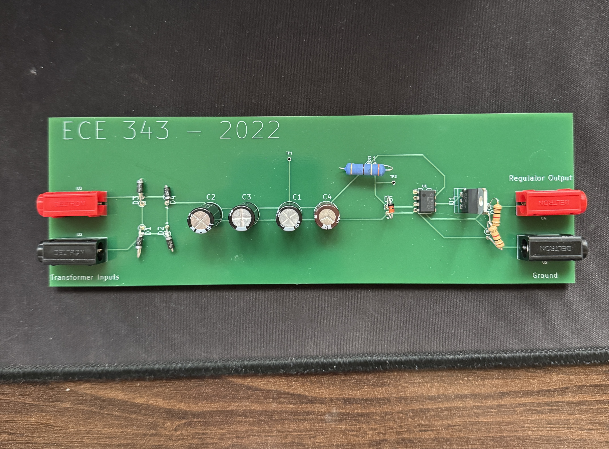

In this lab, we designed each part (rectifier, filter, and regulator) of a basic AC-to-DC converter. We then increased our voltage output (through an OP-AMP) and increased our current rating (through a BJT transistor). For the rectifier, we considered a half-wave and full-wave rectifier, considering the tradeoff between power loss and area. For the filter, we used an RC circuit to determine the desired capacitance necessary to be within a desired ripple voltage level. Finally, for the regulator, we used a zener diode in reverse bias to establish a reference voltage level, having to determine the correct resistance that would limit the current flow through the Zener diode so as to not overheat the diode. For the OP-AMP, we had to connect the OP-AMP in negative feedback and decide upon the correct resistance values to roughly double our voltage output. For the BJT, we had to determine the power loss due to its inclusion. All of this work is laid out in the Lab 5 Report.
After mathematically modeling the circuit, we then built said circuit on a breadboard and tested it. To test it we used function generators, oscilloscopes, and multimeters.
After our circuit was properly tested on our breadboard, we soldered these components onto a PCB board, and then once again tested it to make sure it worked correctly. Overall, the AC-to-DC converter was able to take in standard 120V AC from the wall outlet and convert it to 9.5-10V +/-2% DC open circuit voltage with an output current from 0 - 80 mA. An image of the PCB should be included in this folder.